 <html lang="ja">
 <head>
 <meta charset="UTF-8">
 <title>ホンダ水泳同好会</title>

<link rel="stylesheet" href="../style.css/" type="text/css">

</head>

<body>

<h1><marquee behavior="alternate">!!! ホンダ水泳同好会 !!!</marquee></h1>

<marquee direction="right" scrollamount="20" width="30%">(^_^)/~torokoid</marquee>

<!-- ヘッダ -->
 <header>
 <h1><strong>恒例練習メニュー </strong></h1>
 </header>

<strong> 健保体育館プールにて毎週日曜日AM10:30スタート </strong>

2018/6/24,宇都宮市民大会@ドリーム河内屋内プール

<h3>↓ 画像はクリックで拡大します。閲覧後はブラウザの戻るボタンでお戻りください。</h3>

<h3>↑ 鹿子木さん、くじ引きで2番ゲット！席取りは完璧でした。</h3> 
<a href="002.JPG" class="preview">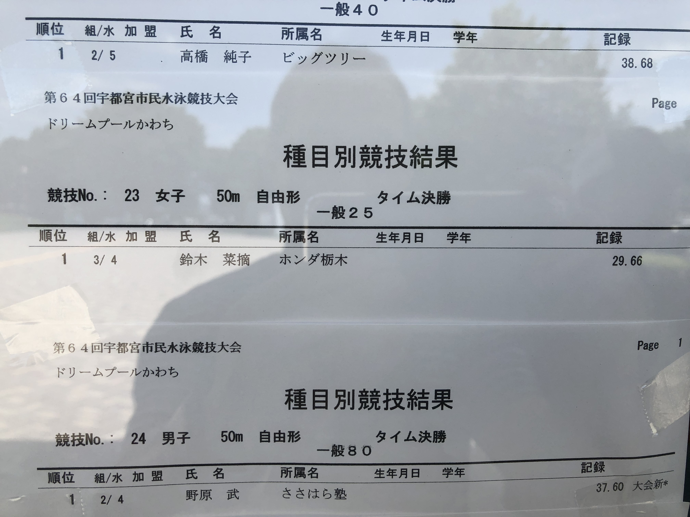</a>

<a href="003.JPG" class="preview">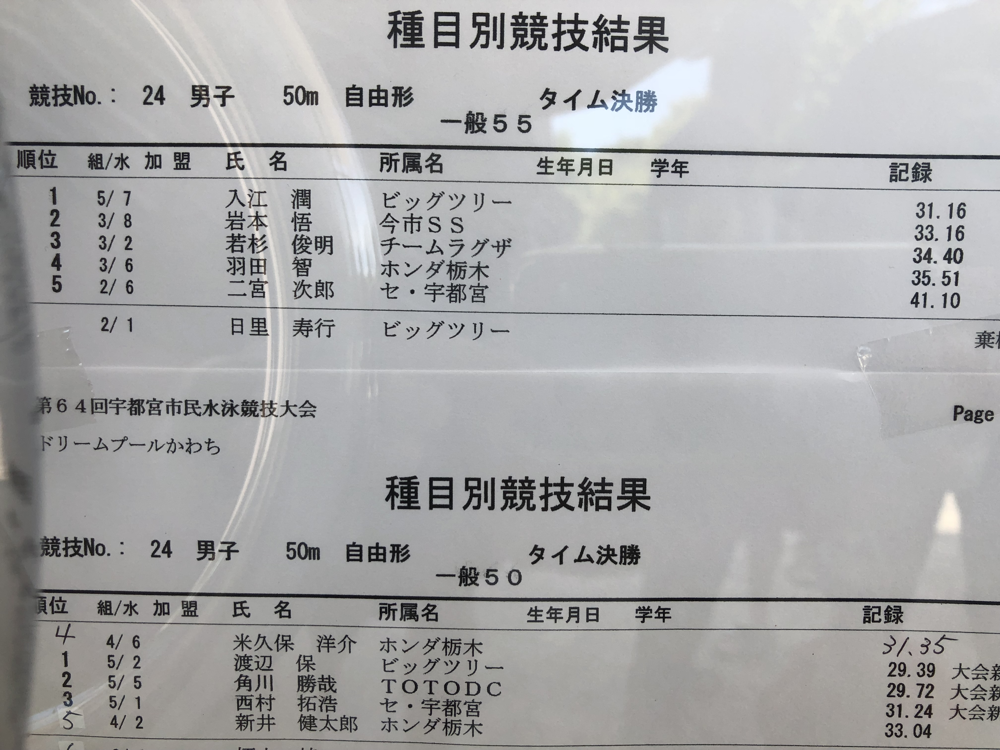</a>
<a href="005.JPG" class="preview">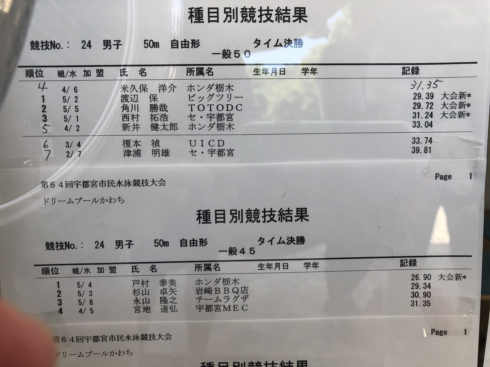</a>
<a href="006.JPG" class="preview">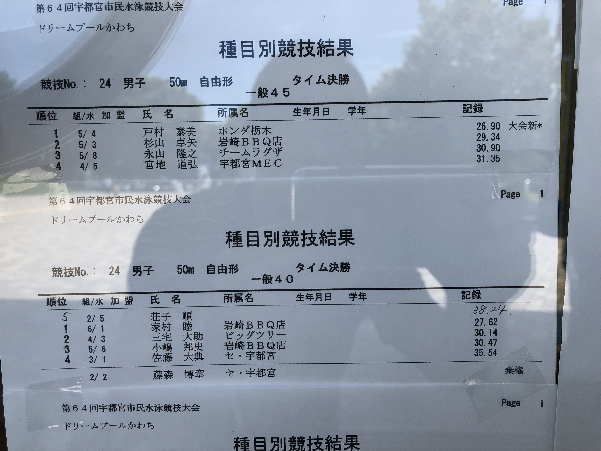</a>
<a href="007.JPG" class="preview">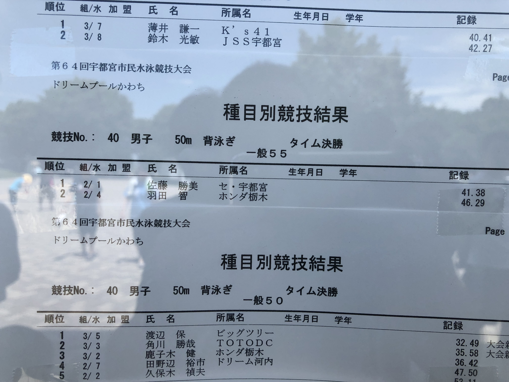</a>
<a href="008.JPG" class="preview">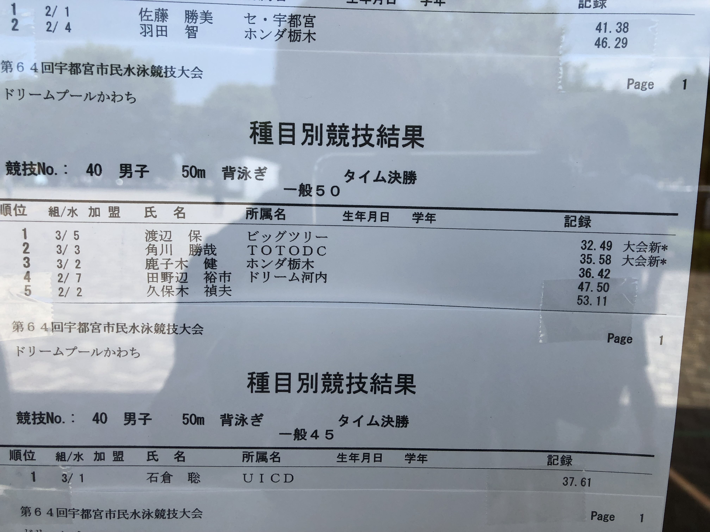</a>
<a href="010.JPG" class="preview">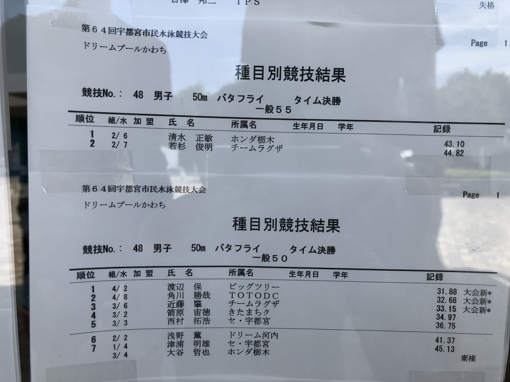</a>
<a href="013.JPG" class="preview">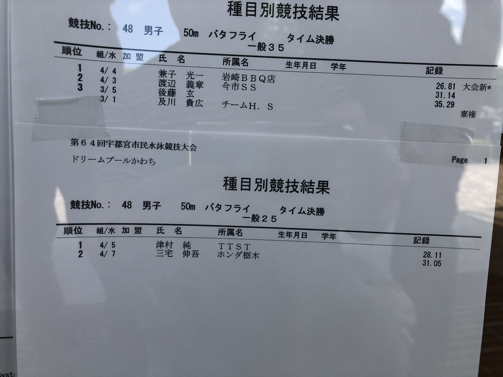</a>
<h6>↓ 清水さんのご要望により、大谷さんクラスのタイムとその他のバッタタイムも掲載しました。</h6> 
<a href="014.JPG" class="preview">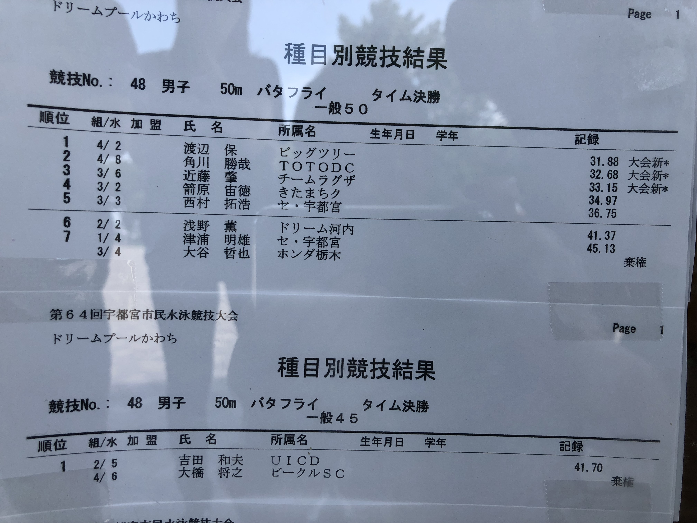</a> 
<a href="011.JPG" class="preview">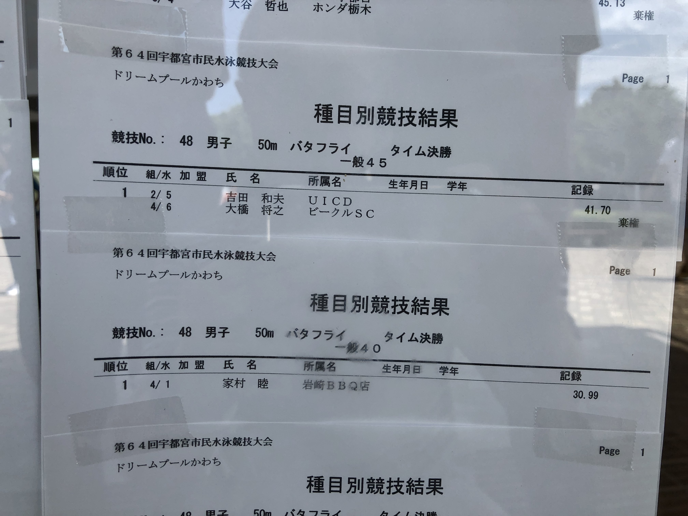</a>
<a href="012.JPG" class="preview">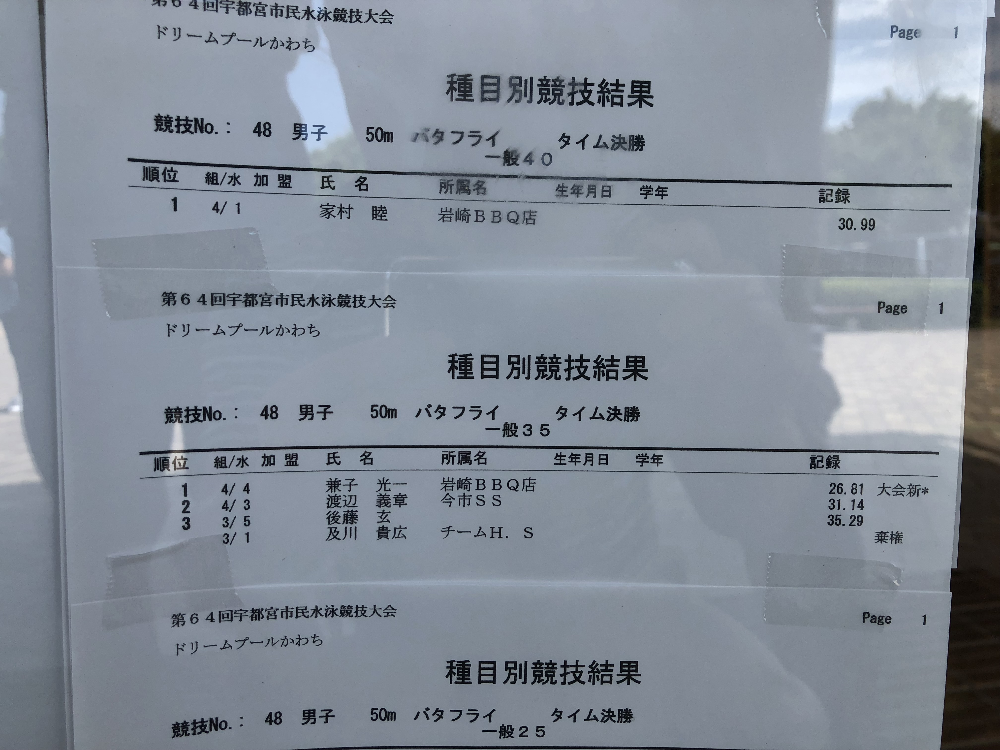</a>
<h4>皆様、お疲れさまでした。試合後は心地よい疲れが残りました。また、明日からガンバ～！</h4>

  

2018/6/17の実績

   
Swim50m x 10 @60sec, Swim25m x 20 @30sec
    Submaline 25m x 8 @60sec
    Pull 50m x 4 @90sec
    Kick 25m, Pull 25m, Swim 25m, All Out!
   
&#160;

   

2018/6/10の実績

   
Swim25m x 20 @30sec 
    Swim50m x 10 @60sec
    one hand pull right25m and left25m x4 with stream line
    one hand pull R,L,comb25m x4 with stream line
    kick25m x4 foot up  with stream line
    start dash	　
   
&#160;

2018/6/3の実績

   
Swim50m x 20 @60sec 
    kick50m x4 @75sec, 2set
    one hand pull right25m and left25m x4 @75sec
    one hand pull R,L,comb25m x4 @75sec
    start dash	　
   
&#160;

2018/5/20の実績

   
Swim25m x 40 @30sec 
    one hand pull R,L,comb,mix
    one hand straight arm pull
    straight arm pull
    start dash	　
   
&#160;

2018/5/13の実績

  
   
Swim25m x 40 @30sec 
    Stream Line
    Stream Line + kick
    Stream Line + kick + one hand pull
    Stream Line + kick + pull	　
    Stream Line + kick + pull & dush!
   
	      <h2>→　kickのペースにpullをシンクロ</h2>

   
&#160;

   <h2> 
      <strong> tips! </strong></h2>
            
pullは二軸を意識して
    kickは蹴り上げで膝を少し曲げて水面から足を出すのがポイント

   
&#160;

   <h2> 
      <strong> ジャパンマスターズ</strong></h2>

<a href="http://www.masters-swim.or.jp/">HPへのリンク</a>

&#160;

   <h2> 
      <strong> 大会公式記録へのリンク </strong></h2>

<a href="http://www.tdsystem.co.jp/ProList.php?Y=2018&M=0&GL=1&G=30">2018年4月15日、マスターズ短水路、仙台結果</a>

・・・25Free、25Batに浜田さん出場

&#160;

 <h2> 
      <strong>大会動画リンク集</strong></h2>
 <a href="https://youtu.be/leZxMlWZFMk" target="_blank">2017/10/29 第14回 栃木県マスターズ水泳 フリーリレー 5組</a> 
 <a href="https://youtu.be/VNcfrJg00mQ" target="_blank">2017/10/29 第14回 栃木県マスターズ水泳 25free 7組</a> 
 <a href="https://youtu.be/i3Wonq-su-c" target="_blank">2017/10/29 第14回 栃木県マスターズ水泳 25free 6組</a> 
 <a href="https://youtu.be/cimOX_hp9Vk" target="_blank">2014/11/09 栃木県マスターズ水泳大会 個人メドレー</a>

&#160;

 <h2>
      <strong>過去の映像</strong></h2>
      
2012/10/28_栃マス表彰状

 
      
2014/07/20_Japan横浜掲示板

&#160;

 <h2> 
      <strong>メンバーに、ネットでも注文できる佃煮やさんが居ます！</strong></h2>
 <a href="http://www.ariakeya.com/" target="_blank">四谷、佃煮「有明家」HPへのリンク</a>

&#160;

宇都宮の天気予報

assembled by <a href="http://mamewaza.com/tools/" target="_blank" rel="nofollow">まめわざ</a>

&#160;

<!-- フッタ -->
 <footer>
 Copyright 2018/05/12 torokoid
 </footer>

