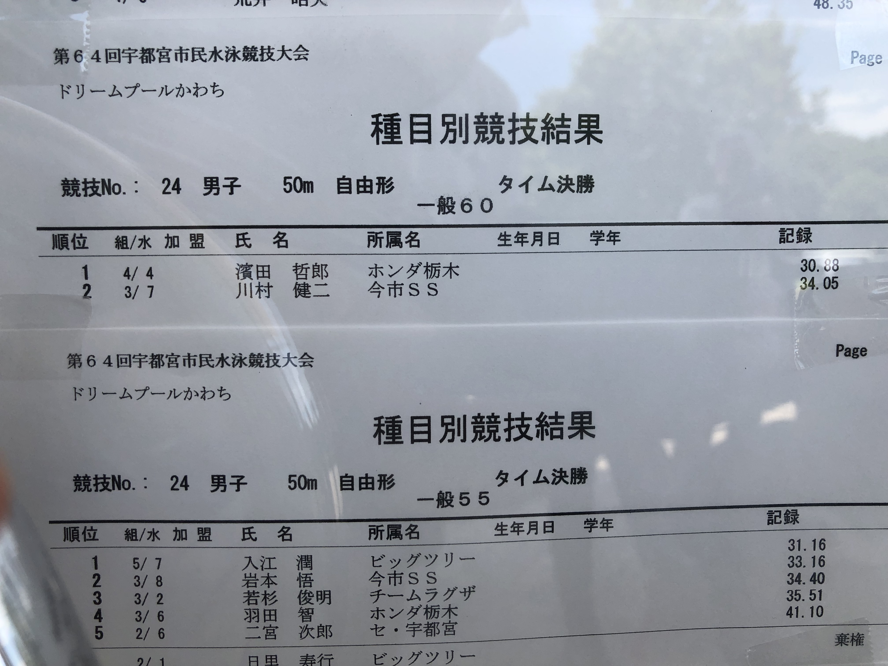
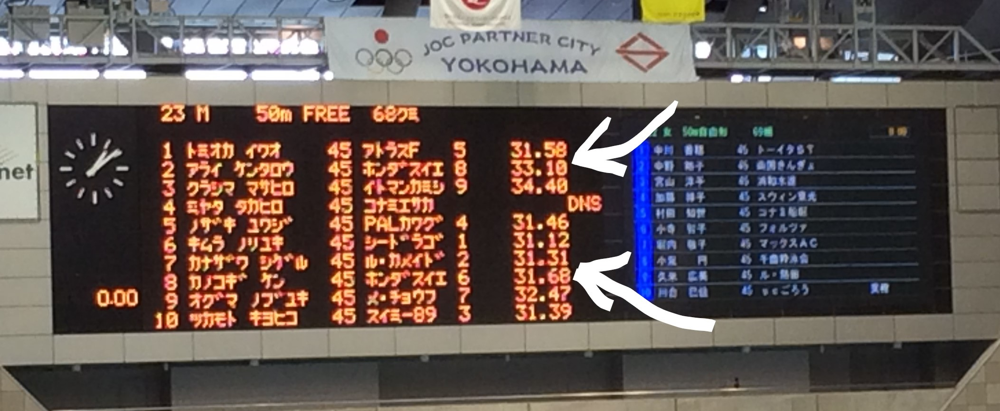
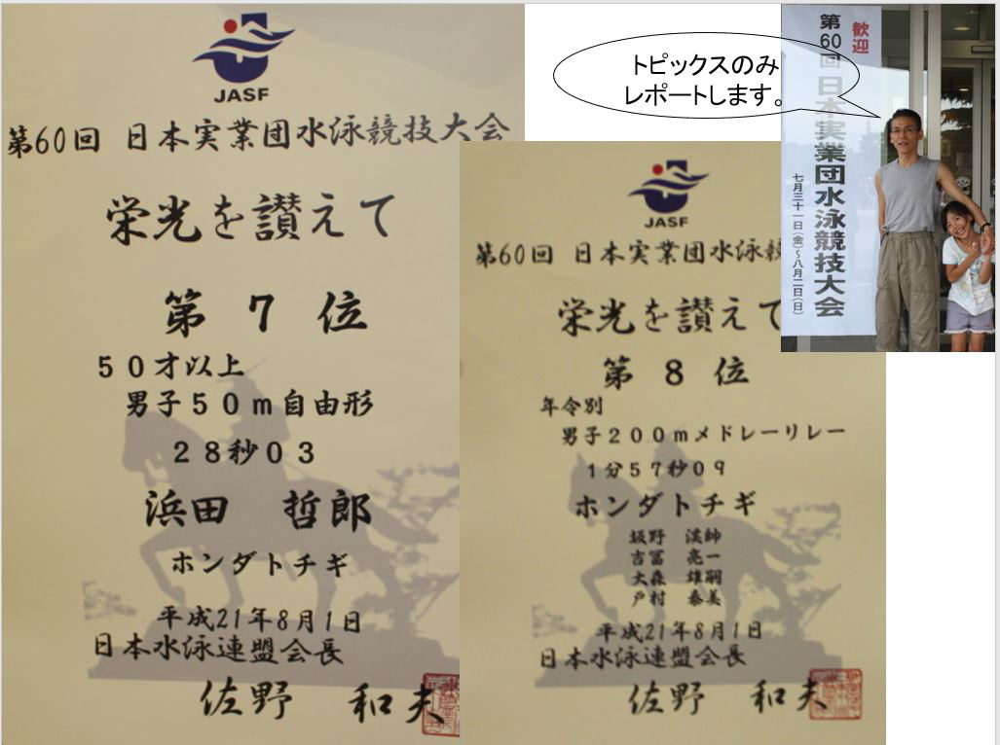
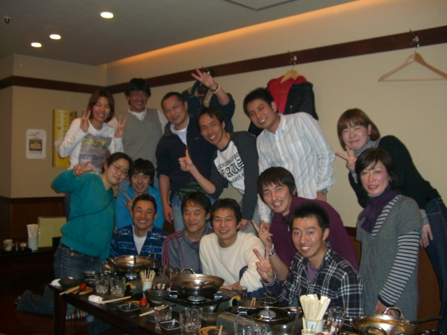
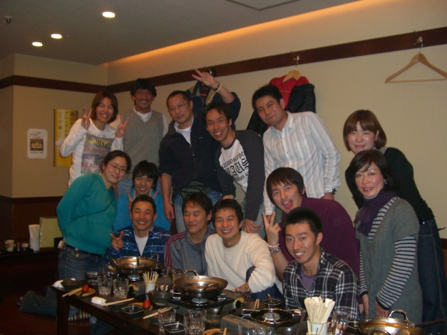

 <html lang="ja">
 <head>
 <meta charset="UTF-8">
 <title>ホンダ水泳同好会</title>

<link rel="stylesheet" href="../style.css/" type="text/css">
<link href="https://cdnjs.cloudflare.com/ajax/libs/lightbox2/2.7.1/css/lightbox.css" rel="stylesheet">
</head>

<body>

<h1><marquee behavior="alternate">!!! ホンダ水泳同好会 !!!</marquee></h1>

<marquee direction="right" scrollamount="20" width="30%">(^_^)/~torokoid</marquee>

<!-- ヘッダ -->
 <header>
 
 </header>

2018/6/24,宇都宮市民大会@ドリーム河内屋内プール,結果

<h3>↓ 画像はクリックで拡大します。閲覧後はブラウザの戻るボタンでお戻りください。</h3>

<h3>↑ 鹿子木さん、くじ引きで2番ゲット！席取りは完璧でした。</h3> 

<h6>↓ 清水さんのご要望により、大谷さんクラスのタイムとその他のバッタタイムも掲載しました。</h6> 
 

<a href="https://github.com/torokoid/Honda_swim_meet/blob/master/2018_%E5%AE%87%E9%83%BD%E5%AE%AE%E5%B8%82%E6%B0%91%E6%B0%B4%E6%B3%B3%E5%A4%A7%E4%BC%9A_%E7%B5%90%E6%9E%9C.pdf">全公式記録へのリンク</a>
 
 
<h4>皆様、お疲れさまでした。試合後は心地よい疲れが残りました。また、明日からガンバ～！</h4>

  

&#160;

 <h2> 
      <strong>バタ足は上手に！</strong></h2>
 <a href="https://headlines.yahoo.co.jp/hl?a=20180704-00000031-asahi-spo" target="_blank">泳速1.3m/s超えると抵抗に！</a> 

&#160;

 <h2>

<h1><strong>恒例練習メニュー </strong></h1>
<h2>
<strong> 健保体育館プールにて毎週日曜日AM10:30スタート </strong>
</h2>

<h2>
  
2018/10/14(大会前特別メニュー)の元ネタメニュー from 戸村さん！

   
Menu&emsp;&emsp;&emsp;&emsp;&emsp;&emsp;Style&emsp;&emsp;Rest&emsp;&emsp;&emsp;SYS&emsp;&emsp;Dist&emsp;&emsp;HR&emsp;Time 
    Attack&emsp;&emsp;Dryland Training & Stretching&emsp;&emsp;&emsp;&emsp;0:10
    W-up&emsp;&emsp;50*8&emsp;&emsp;Smooth Swim Choice&emsp;&emsp;&emsp;&emsp;Ch&emsp;&emsp;&emsp;on1'15"&emsp;&emsp;A1&emsp;&emsp;400&emsp;&emsp;120&emsp;0:12
    R hand Bat 25m, L hand Bat 25m, hand Bat 25m, @75sec x 4set
    Bat 1-Pull and 1-Breth 25m, 2-Pull and 1-Breth 25m, @75sec x 4set
    Bat start dash, @75sec x 4set
    Swim25m @30sec x 40
    R hand Bat 25m, L hand Bat 25m, hand Bat 25m, @75sec x 4set
    Bat 1-Pull and 1-Breth 25m, 2-Pull and 1-Breth 25m, @75sec x 4set
    Bat start dash, @75sec x 4set
    Swim25m @30sec x 40
    R hand Bat 25m, L hand Bat 25m, hand Bat 25m, @75sec x 4set
    Bat 1-Pull and 1-Breth 25m, 2-Pull and 1-Breth 25m, @75sec x 4set
    Bat start dash, @75sec x 4set
   
&#160;

 <h3> 
    <strong>7/29の練習で気づいたのですが、インターバルの合間に気功の呼吸法を取り入れると回復が速いかも</strong></h3>
 <a href="https://torokoid.github.io/kikou/" target="_blank">難解すぎて理解に苦しみますが・・・張明亮、著「気功の真髄」、PC,スマホ用</a> 
 <a href="https://github.com/torokoid/mahoroba/blob/master/%E6%B0%97%E5%8A%9F%E3%81%AE%E7%9C%9F%E9%AB%84.pdf">張明亮、著「気功の真髄」PC用高解像度版</a> 
 <a href="http://www.emei-japan.net/" target="_blank">張明亮、HPリンク</a> 
 <a href="http://www.emei-japan.net/wp-content/uploads/2015/03/%E5%BC%B5%E6%98%8E%E4%BA%AEIMG_0665.jpg" target="_blank">張明亮、老師アップ</a>

&#160;

 
 
 <h2>
  
2018/8/19(夏休み明け)の実績

   
Swim25m @30sec x 40
    R hand Bat 25m, L hand Bat 25m, hand Bat 25m, @75sec x 4set
    Bat 1-Pull and 1-Breth 25m, 2-Pull and 1-Breth 25m, @75sec x 4set
    Bat start dash, @75sec x 4set
   
&#160;

   
 
2018/8/5の実績

   
Swim50m @75secx 4, @70secx 4, @65secx 4, @60sec x 4, @55secx 4
    Bat kick 50m, 75sec x 4set 
    R hand Bat 25m, L hand Bat 25m, hand Bat 25m, @60sec x 4set
    start dash 
   
&#160;

   

2018/7/29の実績

   
Swim50m @75secx 4, @70secx 4, @65secx 4, @60secx 4, @55secx 4
    scaring Bat 25m, 4cycle x 4set, 2cycle x 4set
    R hand Bat 25m, L hand Bat 25m, R and L hand Bat 25m, R and L and both hand Bat @60sec x 4set
    Bat, Bak, Bre, Free dash 
   
&#160;

2018/7/22の実績

   
Swim50m @75secx 4, @70secx 4, @65secx 4, @60secx 4, @55secx 4
    R hand Bat 25m, L hand Bat 25m, R and L hand Bat 25m, 2kick1Pull @50sec x 4set
    R, L and Both hand Bat 25m, 4kick1Pull→ 2kick1Pull→ 2kick Both hand @50sec x 4set
   
&#160;

   <h2> 
      <strong> tips! </strong></h2>
            
Batのhandはフルストロークせずに途中までのイメージで、リカバリは手のひらを下向きに！
    kickはストロークを大きくしすぎないのがポイント

   
&#160;

2018/7/15の実績

   
Swim50m @75secx 4, @70secx 4, @65secx 4, @60secx 4, @55secx 4
    R hand Bat 25m, L hand Bat 25m, R and L hand Bat 25m, 4kick1Pull @50sec x 4set
    R hand Bat 25m, L hand Bat 25m, R and L hand Bat 25m, 2kick1Pull @50sec x 4set
    R, L and Both hand Bat 25m, 4kick1Pull→ 2kick1Pull→ 2kick Both hand @50sec x 4set
   
&#160;

    <h2> 
      <strong> 戸村さんのおすすめ、ピーナッツパドル、導入しました！　開発したのは穴沢さんの先輩です。</strong></h2>

<a href="https://www.youtube.com/watch?v=jqq2kCQRVlY/">Youtubeリンク</a>

   
&#160;

   

2018/7/8の実績

   
Swim50m x 4 @75secx 4, @70secx 4, @65secx 4, @60secx 4, @55secx 4
    R hand Bat 25m, L hand Bat 25m, R and L hand Bat 25m, R, L and Both hand Bat 25m @45sec x 3set
    Dash
   
&#160;

2018/7/1の実績

   
Swim25m x 40 @30sec
    1hand Batta 25m x 4
    Batta Pull 20m x 4
    Batta 25m x 8?
   
&#160;

2018/6/17の実績

   
Swim50m x 10 @60sec, Swim25m x 20 @30sec
    Submaline 25m x 8 @60sec
    Pull 50m x 4 @90sec
    Kick 25m, Pull 25m, Swim 25m, All Out!
   
&#160;

   

2018/6/10の実績

   
Swim25m x 20 @30sec 
    Swim50m x 10 @60sec
    one hand pull right25m and left25m x4 with stream line
    one hand pull R,L,comb25m x4 with stream line
    kick25m x4 foot up  with stream line
    start dash	　
   
&#160;

2018/6/3の実績

   
Swim50m x 20 @60sec 
    kick50m x4 @75sec, 2set
    one hand pull right25m and left25m x4 @75sec
    one hand pull R,L,comb25m x4 @75sec
    start dash	　
   
&#160;

2018/5/20の実績

   
Swim25m x 40 @30sec 
    one hand pull R,L,comb,mix
    one hand straight arm pull
    straight arm pull
    start dash	　
   
&#160;

2018/5/13の実績

  
   
Swim25m x 40 @30sec 
    Stream Line
    Stream Line + kick
    Stream Line + kick + one hand pull
    Stream Line + kick + pull	　
    Stream Line + kick + pull & dush!
   
	      <h2>→　kickのペースにpullをシンクロ</h2>

   
&#160;

   <h2> 
      <strong> tips! </strong></h2>
            
pullは二軸を意識して
    kickは蹴り上げで膝を少し曲げて水面から足を出すのがポイント

   
&#160;

   <h2> 
      <strong> ジャパンマスターズ</strong></h2>

<a href="http://www.masters-swim.or.jp/">HPへのリンク</a>

&#160;

   <h2> 
      <strong> 大会公式記録へのリンク </strong></h2>

<a href="http://www.tdsystem.co.jp/ProList.php?Y=2018&M=0&GL=1&G=30">2018年4月15日、マスターズ短水路、仙台結果</a>

・・・25Free、25Batに浜田さん出場

&#160;

 <h2> 
      <strong>大会動画リンク集</strong></h2>
 <a href="https://youtu.be/leZxMlWZFMk" target="_blank">2017/10/29 第14回 栃木県マスターズ水泳 フリーリレー 5組</a> 
 <a href="https://youtu.be/VNcfrJg00mQ" target="_blank">2017/10/29 第14回 栃木県マスターズ水泳 25free 7組</a> 
 <a href="https://youtu.be/i3Wonq-su-c" target="_blank">2017/10/29 第14回 栃木県マスターズ水泳 25free 6組</a> 
 <a href="https://youtu.be/cimOX_hp9Vk" target="_blank">2014/11/09 栃木県マスターズ水泳大会 個人メドレー</a>

&#160;

 <h2>
      <strong>過去の映像</strong></h2>
            
2014/07/20_Japan横浜掲示板

<a href="20140720_Japan横浜.jpg" class="preview" data-lightbox="bcd" data-title="2014/07/20_Japan横浜掲示板">

&#160;

      
2012/10/28_栃マス表彰状

<a href="20121028_栃マス.JPG" class="preview" data-lightbox="bcd"  data-title="2012/10/28_栃マス表彰状"> 

&#160;

            
2009/8/1_実業団表彰状

<a href="20090801_jitsugyoudan.JPG" class="preview" data-lightbox="bcd" data-title="2009/08/01_実業団表彰状"> 
 
&#160;

            
2008/8/2_つくね亭

<a href="080802水泳集まり@つくね亭 (1).JPG" class="preview" data-lightbox="bcd" data-title="2008/08/02_水泳集まり@つくね亭_1"> 
<a href="080802水泳集まり@つくね亭 (2).JPG" class="preview" data-lightbox="bcd" data-title="2008/08/02_水泳集まり@つくね亭_2"> 
<a href="CIMG2218.JPG" class="preview" data-lightbox="bcd" data-title="2008/08/02_水泳集まり@つくね亭_3"> 
<a href="CIMG2217.JPG" class="preview" data-lightbox="bcd" data-title="2008/08/02_水泳集まり@つくね亭_4"> 

&#160;

&#160;

<h3> 
      <strong>メンバーに、ネットでも注文できる佃煮やさんが居ます！</strong> </h3>
 <h2><a href="http://www.ariakeya.com/" target="_blank">⇒ 四谷、佃煮「有明家」HPへのリンク</a></h2>

&#160;

宇都宮の天気予報

assembled by <a href="http://mamewaza.com/tools/" target="_blank" rel="nofollow">まめわざ</a>

&#160;

<!-- フッタ -->
 <footer>
 Copyright 2018/05/12 torokoid
 </footer>

